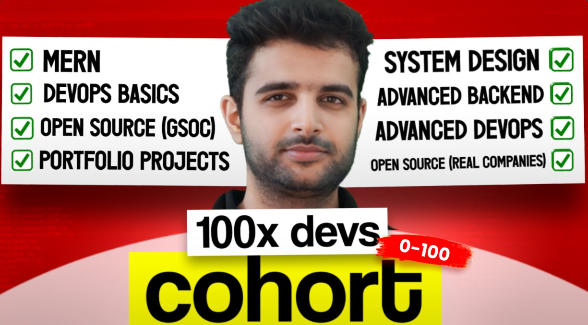

# **❤️Documentation for 100xDevs-Cohort-2.0 🙏**

### _[100xDevs-Cohort-2.0](https://100xdevs.com/new-courses/8-live-0-100-complete) from 0 - 100 🚀 by [Harkirat Singh](https://www.linkedin.com/in/kirat-li/). This repository contains Assignment, Class Notes, Solutions to Coding Questions taken during this Live course.

## Topics addressed in the Cohort's Curriculum

1. **MERN STACK**
2. **DEVOPS BASICS**
3. **OPEN SOURCE (GSOC)**
4. **PORTFOLIO PROJECTS**
5. **SYSTEM DESIGN**
6. **ADVANCED BACKEND**
7. **ADVANCED DEVOPS**
8. **OPEN SOURCE(REAL COMPANIES)**

## 📙Week 1.1[ _- Orientation_](./Chapter%2001%20-%20Inception/) (Date: 02-12-2023)

## 📙Week 1.2[ _- JS Foundation_](./Chapter%2001%20-%20Inception/)(Date: 03-12-2023)
